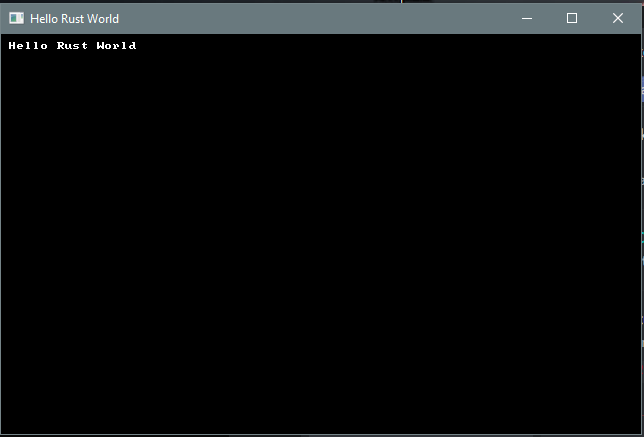

# 第一节：Hello Rust

---

***关于这个教程***

*此教程是免费且开源的，所有代码均使用MIT许可证 - 所以你可以随意使用它。我希望你可以享受这个学习的过程，并制作出很棒的游戏。!*

*如果你喜欢这个教程并希望我继续写作，请考虑支持[my Patreon](https://www.patreon.com/blackfuture).*

---

这个系列教程主要是教授如果制作roguelikes游戏(以及其他游戏的扩展), 它也会帮助你学会如何使用Rust和RLTK - 我们将使用*Roguelike Tool Kit* 来提供输入和输出。即使你不想使用Rust，我也希望您能够从这个教程中的结构，想法，和通用游戏开发建议中收益。

## 为什么选择Rust？

Rust在2010年诞生，但是直到最近才达到稳定的状态 - 也就是说，当语言现在发生改动时，你写的代码可能就不能正常工作了。Rust的开发工作仍在继续，它的全新章节（如异步系统）正在趋于稳定。 此教程将会远离Rust开发的边缘，使用稳定的特性。

Rust被设计为“更好的系统级语言” - 也就是说，它和`C++`一样是底层语言，但是却很少会像C++一样搬起石头砸自己的脚(shoot yourself in the foot)，它关注于避免很多使C++开发变得困难的陷进，尤其是它投入了大量的精力在内存和线程安全上：它被设计成很难编写出破坏其内存安全或造成条件竞争的程序(这不是不可能，但你必须尝试!)。它迅速吸引了人们的注意，从Mozilla到Microsoft的每个人都对它表现出浓厚的兴趣 - 并用它编写了越来越多的工具。

Rust也被设计成比C++拥有更好的生态系统。`Cargo`提供了一个完整的包管理器（就像是C++中的`vcpkg`，`conan`，但是cargo却更容易集成），一个完整的构建系统（和`cmake`，`make`，`meson`类似，但是更具标准化）。它还不能像C/C++一样运行在大多数平台上，但是这个清单在不断的增长。

我在朋友的督促下尝试了Rust，发现它虽然不能代替我日常工具箱中的C++ - 但是有时候它确实可以使一个项目脱引而出。它的语法需要一段时间来适应，但是它确实可以很好的融入现有的基础架构中。

## 学习Rust

如果你使用过其他的编程语言，那么这里有很多有用的帮助！

* [The Rust Programming Language Book](https://doc.rust-lang.org/book/)对这门语言提供了一个卓越的，自上而下的介绍。
* [Learn Rust by Example](https://doc.rust-lang.org/rust-by-example/)更接近我首选的学习方式(我已经学习过很多门语言)，它为你可能会遇到的大多数场景提供了通用的示例。
* [24 Days of Rust](https://zsiciarz.github.io/24daysofrust/index.html) 提供了一些针对网络的24天学习Rust的课程。
* [Rust's Ownership Model for JavaScript Developers](https://blog.thoughtram.io/rust/2015/05/11/rusts-ownership-model-for-javascript-developers.html)对来自JS或者其他高级语言的同学或许有用。

如果你在这里没有找到你想要的东西，可能其他人已经写了一个`crate`(类似于其他语言的package，但是cargo将其命名为crate)以供使用。一旦你有了一个开发环境，你可以执行`cargo search <my term>`来寻找有用的类库。你也可以直接访问[crates.io](https://crates.io/)查看Cargo中提供的crate的完整列表 - 包含完整的文档和示例。

如果你是一个完全的编程新手，这里有一个坏消息：Rust是一个相对年轻的语言，所以没有很多“从头开始学Rust编程”的资料。你可能发现从一个高级语言开始会更容易，然后再“向下”(更接近底层)过渡到Rust。但是，如果你决定尝试以下，上面的资料应该可以帮助你入门。

## 获取Rust

在你大多数平台，[rustup](https://rustup.rs/)已经足够让你获取一个Rust工具链。在Windows中，它很容易下载 - 当安装过程结束后你就可以获取可用的Rust环境。在Unix衍生的系统中（类如Linux，OSX），它提供了一个可以安装环境的命令行指令。

一旦安装完成，在命令行中输入`cargo --version`检查其是否生效。你应该可以看见诸如`cargo 1.36.0 (c4fcfb725 2019-05-15)` (版本可能会随着时间而改变)的文本。

## 搭建舒适的开发环境

你想要为你的开发工作创建一个目录(个人使用`users/herbert/dev/rust` - 但是这是个人的选择。它其实可以是任何你喜欢的目录)。你也需要一个文本编辑器。我是[Visual Studio Code](https://code.visualstudio.com/)的脑残粉，你可以选择任何更习惯的编辑器。如果你选择Visual Studio Code，我推荐安装下面的扩展：

* `Better TOML` : 更好的读取toml文件。Rust会经常用到。
* `C/C++` : 使用C++的调试系统来调试Rust代码。
* `Rust (rls)` : 不是最快的 ，但是可以提供语法高亮和错误检查。

一旦你配置好了环境，打开编辑器并导航到你指定的文件夹(在VS Code中，使用`File -> Open Folder`并选择文件夹)。

## 创建一个项目

既然你已经在选定的文件夹中，你想要在这里打开一个终端窗口。在VS Code中，使用`Terminal -> New Terminal`。否则，通常是打开一个命令行并使用`cd`命令来到指定的文件夹中。

Rust有一个内置的软件包管理器，叫`cargo`。Cargo可以为你创建项目模版! 所以为了创建你的新项目，执行`cargo init hellorust`过了一会，一个新的文件呢目录就出现在你的项目中 - 名为`hellorust`。
它将会包含下面的文件和目录：

```
src\main.rs
Cargo.toml
.gitignore
```

它们是：

* 如果你在使用git，那么`.gitignore`会很方便 - it stops you from accidentally putting files into the git repository that don't need to be there. If you aren't using git, you can ignore it.
* `src\main.rs` is a simple Rust "hello world" program source.
* `Cargo.toml` defines your project, and how it should be built.

### Quick Rust Introduction - The Anatomy of Hello World

The auto-generated `main.rs` file looks like this:

```rust
fn main() {
    println!("Hello, world!");
}
```

If you've used other programming languages, this should look somewhat familiar - but the syntax/keywords are probably different. *Rust* started out as a mashup between [ML](https://en.wikipedia.org/wiki/ML_(programming_language)) and C, with the intent to create a flexible "systems" language (meaning: you can write bare-metal code for your CPU without needing a virtual machine like Java or C# do). Along the way, it inherited a lot of syntax from the two languages. I found the syntax looked *awful* for the first week of using it, and came quite naturally after that. Just like a human language, it takes a while for your brain to key into the syntax and layout.

So what does this all mean?

1. `fn` is Rust's keyword for *function*. In JavaScript or Java, this would read `function main()`. In C, it would read `void main()` (even though `main` is meant to return an `int` in C). In C#, it would be `static void Main(...)`.
2. `main` is the *name* of the function. In this case, the name is a special case: the operating system needs to know what to run first when it loads a program into memory - and Rust will do the extra work to mark `main` as the first function. You generally *need* a `main` function if you want your program to do anything, unless you are making a *library* (a collection of functions for other programs to use).
3. The `()` is the function *arguments* or *parameters*. In this case, there aren't any - so we just use empty opening and closing parentheses.
4. The `{` indicates the start of a *block*. In this case, the block is the *body* of the function. Everything within the `{` and `}` is the *content* of the function: instructions for it to run, in turn. Blocks also denote *scope* - so anything you declare inside the function has its access limited to that function. In other words, if you make a variable inside a function called `cheese` - it won't be visible from inside a function called `mouse` (and vice versa). There are ways around this, and we'll cover them as we build our game.
5. `println!` is a *macro*. You can tell Rust macros because they have an `!` after their name. You can learn all about macros [here](https://doc.rust-lang.org/1.2.0/book/macros.html); for now, you just need to know that they are *special* functions that are parsed into *other code* during compilation. Printing to the screen can be quite complicated - you might want to say more than "hello world" - and the `println!` macro covers a *lot* of formatting cases. (If you are familiar with C++, it's equivalent to `std::fmt`. Most languages have their own string formatting system, since programmers tend to have to output a lot of text!)
6. The final `}` closes the block started in `4`.

Go ahead and type `cargo run`. After some compilation, if everything is working you will be greeted with "Hello World" on your terminal.

### Useful `cargo` commands

Cargo is quite the tool! You can learn a bit about it [from the Learn Rust book](https://doc.rust-lang.org/1.2.0/book/hello-cargo.html), and *everything* about it from [The Cargo Book](https://doc.rust-lang.org/cargo/) if you are interested.

You'll be interacting with `cargo` a *lot* while you work in Rust. If you initialize your program with `cargo init`, your program is a cargo *crate*. Compilation, testing, running, updating - Cargo can help you with all of it. It even sets up `git` for you by default.

You may find the following `cargo` features handy:

* `cargo init` creates a new project. That's what you used to make the hello world program. If you *really* don't want to be using `git`, you can type `cargo init --vcs none (projectname)`.
* `cargo build` downloads all dependencies for a project and compiles them, and then compiles your program. It doesn't actually *run* your program - but this is a good way to quickly find compiler errors.
* `cargo update` will fetch new versions of the *crates* you listed in your `cargo.toml` file (see below).
* `cargo clean` can be used to delete *all* of the intermediate work files for your project, freeing up a bunch of disk space. They will automatically download and recompile the next time you run/build your project. Occasionally, a `cargo clean` can help when things aren't working properly - particularly IDE integration.
* `cargo verify-project` will tell you if your Cargo settings are correct.
* `cargo install` can be used to install programs via Cargo. This is helpful for installing tools that you need.

Cargo also supports *extensions* - that is, plugins that make it do even more. There are some that you may find particularly useful:

* Cargo can reformat all your source code to look like standard Rust from the Rust manuals. You need to type `rustup component add rustfmt` *once* to install the tool. After that's done, you can type `cargo fmt` to format your code at any time.
* If you'd like to work with the `mdbook` format - used for [this book](https://github.com/thebracket/rustrogueliketutorial)! - cargo can help with that, too. Just once, you need to run `cargo install mdbook` to add the tools to your system. After that, `mdbook build` will build a book project, `mdbook init` will make a new one, and `mdbook serve` will give you a local webserver to view your work! You can learn all about `mdbook` [on their documentation page](https://rust-lang-nursery.github.io/mdBook/cli/index.html).
* Cargo can also integrate with a "linter" - called `Clippy`. Clippy is a little pedantic (just like his Microsoft Office namesake!). Just the once, run `rustup component add clippy`. You can now type `cargo clippy` at any time to see suggestions for what may be wrong with your code!


### Making a new project

Lets modify the newly created "hello world" project to make use of [RLTK](https://github.com/thebracket/bracket-lib) - the Roguelike Toolkit.

## Setup Cargo.toml

The auto-generated Cargo file will look like this:

```toml
[package]
name = "helloworld"
version = "0.1.0"
authors = ["Your name if it knows it"]
edition = "2018"

# See more keys and their definitions at https://doc.rust-lang.org/cargo/reference/manifest.html

[dependencies]
```

Go ahead and make sure that your name is correct! Next, we're going to ask Cargo to use RLTK - the Roguelike toolkit library. Rust makes this very easy. Adjust the `dependencies` section to look like this:

```toml
[dependencies]
rltk = { version = "0.8.0" }
```

We're telling it that the package is named `rltk`, and is available in Cargo - so we just have to give it a version. You can do `cargo search rltk` to see the latest version at any time, or go to [the crate webpage](https://crates.io/crates/rltk).

It's a good idea to occasionally run `cargo update` - this will update the libraries used by your program.

## Hello Rust - RLTK Style!

Go ahead and replace the contents of `src\main.rs` with:

```rust
use rltk::{Rltk, GameState};

struct State {}
impl GameState for State {
    fn tick(&mut self, ctx : &mut Rltk) {
        ctx.cls();
        ctx.print(1, 1, "Hello Rust World");
    }
}

fn main() -> rltk::BError {
    use rltk::RltkBuilder;
    let context = RltkBuilder::simple80x50()
        .with_title("Roguelike Tutorial")
        .build()?;
    let gs = State{ };
    rltk::main_loop(context, gs)
}
```

Now create a new folder called `resources`. RLTK needs a few files to run, and this is where we put them. Download [resources.zip](./resources.zip), and unzip it into this folder. Be careful to have `resources/backing.fs` (etc.) and not `resources/resources/backing.fs`.

Save, and go back to the terminal. Type `cargo run`, and you will be greeted with a console window showing `Hello Rust`.



If you're new to Rust, you are probably wondering what exactly the `Hello Rust` code does, and why it is there - so we'll take a moment to go through it.

1. The first line is equivalent to C++'s `#include` or C#'s `using`. It simply tells the compiler that we are going to require `Rltk` and `GameState` types from the namespace `rltk`. You used to need an additional `extern crate` line here, but the most recent version of Rust can now figure it out for you.
2. With `struct State{}`, we are creating a new `structure`. Structures are like Records in Pascal, or Classes in many other languages: you can store a bunch of data inside them, and you can also attach "methods" (functions) to them. In this case, we don't actually need any data - we just need a place to attach code. If you'd like to learn more about Structs, [this is the Rust Book chapter on the topic](https://doc.rust-lang.org/book/ch05-00-structs.html)
3. `impl GameState for State` is quite a mouthful! We're telling Rust that our `State` structure *implements* the *trait* `GameState`. Traits are like interfaces or base classes in other languages: they setup a structure for you to implement in your own code, which can then interact with the library that provides them - without that library having to know anything else about your code. In this case, `GameState` is a trait provided by RLTK. RLTK requires that you have one - it uses it to call into your program on each frame. You can learn about traits [in this chapter of the Rust book](https://doc.rust-lang.org/book/ch10-02-traits.html).
4. `fn tick(&mut self, ctx : &mut Rltk)` is a *function* definition. We're inside the trait implementation scope, so we are implementing the function *for* the trait - so it *has* to match the type required by the trait. Functions are a basic building block of Rust, I recommend [the Rust book chapter on the topic](https://doc.rust-lang.org/book/ch03-03-how-functions-work.html). 
    1. In this case, `fn tick` means "make a function, called tick" (it's called "tick" because it "ticks" with each frame that is rendered; it's common in game programming to refer to each iteration as a tick). 
    2. It doesn't end with an `-> type`, so it is equivalent to a `void` function in C - it doesn't return any data once called. The parameters can also benefit from a little explanation. 
    3. `&mut self` means "this function requires access to the parent structure, and may change it" (the `mut` is short for "mutable" - meaning it can change variables inside the structure - "state"). You can also have functions in a structure that just have `&self` - meaning, we can *see* the content of the structure, but can't change it. If you omit the `&self` altogether, the function can't see the structure at all - but can be called as if the structure was a *namespace* (you see this a lot with functions called `new` - they make a new copy of the structure for you).
    4. `ctx: &mut Rltk` means "pass in a variable called `ctx`" (`ctx` is an abbreviation for "context"). The colon indicates that we're specifying what *type* of variable it must be. 
    5. `&` means "pass a reference" - which is a *pointer* to an existing copy of the variable. The variable isn't copied, you are working on the version that was passed in; if you make a change, you are changing the original. [The Rust Book explains this better than I can](https://doc.rust-lang.org/book/ch04-02-references-and-borrowing.html).
    6. `mut` once again indicates that this is a "mutable" reference: you are allowed to make changes to the context.
    7. Finally `Rltk` is the *type* of the variable you are receiving. In this case, it's a `struct` defined inside the `RLTK` library that provides various things you can do to the screen.
5. `ctx.cls();` says "call the `cls` function provided by the variable `ctx`. `cls` is a common abbreviation for "clear the screen" - we're telling our *context* that it should clear the virtual terminal. It's a good idea to do this at the beginning of a frame, unless you specifically don't want to.
6. `ctx.print(1, 1, "Hello Rust World");` is asking the *context* to *print* "Hello Rust World" at the location (1,1).
7. Now we get to `fn main()`. *Every* program has a `main` function: it tells the operating system where to start the program.
8. ```
    use rltk::RltkBuilder;
    let context = RltkBuilder::simple80x50()
        .with_title("Roguelike Tutorial")
        .build()?;
   ```
   is an example of calling a *function* from inside a `struct` - where that struct doesn't take a "self" function. In other languages, this would be called a *constructor*. We're calling the function `simple80x50` (which is a builder provided by RLTK to make a terminal 80 characters wide by 50 characters high. The window title is "Roguelike Tutorial".
9. `let gs = State{ };` is an example of a *variable* assignment (see [The Rust Book](https://doc.rust-lang.org/book/ch03-01-variables-and-mutability.html)). We're making a new variable called `gs` (short for "game state"), and setting it to be a copy of the `State` struct we defined above.
10. `rltk::main_loop(context, gs)` calls into the `rltk` namespace, activating a function called `main_loop`. It needs both the `context` and the `GameState` we made earlier - so we pass those along. RLTK tries to take some of the complexity of running a GUI/game application away, and provides this wrapper. The function now takes over control of the program, and will call your `tick` function (see above) every time the program "ticks" - that is, finishes one cycle and moves to the next. This can happen 60 or more times per second!

Hopefully that made some sense!

## Playing with the tutorials

You'd probably like to play with the tutorial code without having to type it all in! The good news is that it is up on GitHub for your perusal. You need to have `git` installed (RustUp should have helped you with that). Choose where you would like to have the tutorials, and open a terminal:

```bash
cd <path to tutorials>
git clone https://github.com/thebracket/rustrogueliketutorial .
```

After a while, this will download the complete tutorial (including the source code for this book!). It is laid out as follows (this isn't complete!):

```
───book
├───chapter-01-hellorust
├───chapter-02-helloecs
├───chapter-03-walkmap
├───chapter-04-newmap
├───chapter-05-fov
├───resources
├───src
```

What's here?

* The `book` folder contains the source code for this book. You can ignore it, unless you feel like correcting my spelling!
* Each chapter's example code is contained in `chapter-xy-name` folders; for example, `chapter-01-hellorust`.
* The `src` folder contains a simple script to remind you to change to a chapter folder before running anything.
* `resources` has the contents of the ZIP file you downloaded for this example. All the chapter folders are preconfigured to use this.
* `Cargo.toml` is setup to include all of the tutorials as "workspace entries" - they share dependencies, so it won't eat your whole drive re-downloading everything each time you use it.

To run an example, open your terminal and:

```bash
cd <where you put the tutorials>
cd chapter-01-hellorust
cargo run
```

If you are using *Visual Studio Code*, you can instead use *File -> Open Folder* to open the whole directory that you checked out. Using the inbuilt terminal, you can simply `cd` to each example and `cargo run` it.

## Accessing Tutorial Source Code

You can get to the source code for all of the tutorials at [https://github.com/thebracket/rustrogueliketutorial](https://github.com/thebracket/rustrogueliketutorial).

## Updating the Tutorial

I update this tutorial a lot - adding chapters, fixing issues, etc. You will periodically want to open the tutorial directory, and type `git pull`. This tells `git` (the source control manager) to go to the `Github` repository and look for what's new. It will then download everything that has changed, and you once again have up-to-date tutorials.

## Updating Your Project

You may find that `rltk_rs` or another package has updated, and you would like the latest version. From your project's folder, you can type `cargo update` to update *everything*. You can type `cargo update --dryrun` to see what it would like to update, and not change anything (people update their crates a lot - so this can be a big list!).

## Updating Rust Itself

I don't recommend running this from inside `Visual Studio Code` or another IDE, but if you'd like to ensure that you have the most recent release of `Rust` (and associated tools), you can type `rustup self update`. This updates the Rust update tools (I know that sounds rather recursive). You can then type `rustup update` and install the latest versions of all of the tools.

## Getting Help

There's a number of ways to get help:

* Feel free to contact me (I'm `@herberticus` on Twitter) if you have any questions, ideas for improvements, or things you'd like me to add.
* The fine people on [/r/rust](https://www.reddit.com/r/rust/) are VERY helpful with Rust language issues.
* The awesome people of [/r/roguelikedev](https://www.reddit.com/r/roguelikedev/) are VERY helpful when it comes to Roguelike issues. Their Discord is pretty active, too.

[Run this chapter's example with web assembly, in your browser (WebGL2 required)](https://bfnightly.bracketproductions.com/rustbook/wasm/chapter-01-hellorust/)

---

Copyright (C) 2019, Herbert Wolverson.

---
