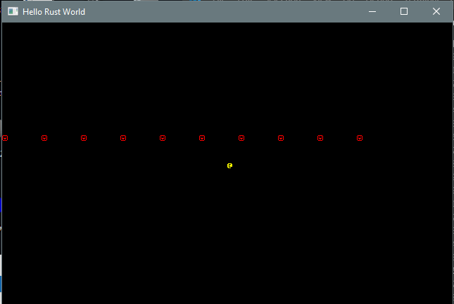
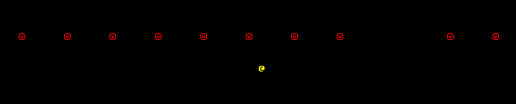
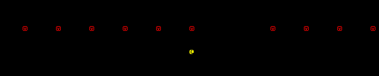

# Chapter 2 - 实体与组件

---

***关于这个教程***

*此教程是免费且开源的，所有代码均使用MIT许可证 - 所以你可以随意使用它。我希望你可以享受这个学习的过程，并制作出很棒的游戏。!*

*如果你喜欢这个教程并希望我继续写作，请考虑支持 [my Patreon](https://www.patreon.com/blackfuture).*

---

这一节将会完整的介绍实体组件系统(Entity Component System - ECS)，这将会构成本教程余下部分的基石。Rust有一个非常棒的ECS，叫做Specs - 这篇文章将会教会你如何使用它，并尝试证明使用它的一些早期的好处。

## 关于实体与组件

如果你之前从事过游戏开发，你可能已经习惯了面向对象的设计(即使在启发了此项目的Python版`libtcod`教程中也十分常见). 面向对象(OOP)的设计真的没有什么问题 - 但是游戏开发者已经基本不用了，主要是因为当你开始将游戏扩展到超出最初的设计思路时，就会变得很混乱。

你可能会看到这种“类层次结构”，例如：

```
BaseEntity
    Monster
        MeleeMob
            OrcWarrior
        ArcherMob
            OrcArcher
```

你可能会遇到比这更复杂的事情，但这只是一个例证。`BaseEntity`将包含显示在地图上的实体所需的代码和数据，`Monster`暗示他是一个坏家伙，`MeleeMob`将会保持寻找近战目标的逻辑，接近并消灭他们。同样，`ArcherMob`会尝试维持最佳射程 (optimal range) 并使用远程武器在安全距离处射击。 问题是这样分类 (taxonomy) 可能是具有限制性的，在你知道之前 - 你就已经开始为更加复杂的组合编写单独的类。举个例子，如果我们想出一个可以同时近战 (melee) 和射箭 (archery) 的兽人 (orc) - 并且在你完成了 *Friends With The Greenskins* 任务后，可能变得友善? 你可能最终会将这些逻辑组合成一个特例类。这确实有用 - 并且大量的游戏也都是这样做的 - 但是这里还有一种更简单的方式吗？

基于实体组件的设计试图消除 (eliminate) 层次结构 (hierarchy)，取而代之的是实现一套“组件”来描述你想要的东西。“实体”是一个事物 - 可以是任何事物，真的。一只兽人，一匹狼，一瓶药水 (potion)，一个由硬件驱动的空灵幽魂 - 无论你想要什么。这十分简单：仅仅是一个可标识的数字。来自实体的魔法可以添加任意数量的*组件*。组件即数据，按照赋予实体的属性分组。

举个例子，你可以使用以下组件来构建同一组战士：`位置`，`渲染`，`敌对`，`近战AI`，`远程AI`，和某些战斗统计的组件(来告诉你关于他们的武器，命中率(hit point)等信息)。 兽人战士需要一个位置以便你能够知道他们在哪儿，他们是可渲染的因此你知道如何绘制他们。他充满敌意，因此将他标记为敌对状态。给他提供一个近战AI和一套游戏统计数据，然后你就拥有了你需要的一切，可以让他接近玩家并攻击他们。射手同理，只不过将远程AI替换了近战AI。一个杂交体可以持有所有的组件，如果你想要自定义行为，则可以同时拥有两个AI或其他类型的AI。如果你的兽人变得友好，你可以移除他的敌对组件，并添加一个友善组件。

换句话说，组件就像是你的继承树，但是你不是通过继承trait而是通过添加组件来进行组合，直到达到了你的期望为止。这经常被称为“组合”。

ECS 中的“S”代表“系统”。*系统*是一段代码，可以从实体/组件列表中收集数据并对其进行处理。实际上它与继承模型非常类似，但在某些方面它是“向后”的。举个例子，在OOP系统中进行绘制通常是：*调用每一个实体的绘制命令*。在ECS系统中，它却是*获取所有具有位置信息和可渲染组件的实体，然后使用该数据绘制它们*。

对于小游戏，ECS感觉就像是在你的代码中添加了一些额外的的输入。你需要预先进行其他的工作，以使得以后的生活更加轻松。

有太多东西需要消化，让我们来看一个小例子，ECS 是如何让你的生活更加轻松的。

重要的是要知道ECS仅仅是处理组合的一种方式。还有很多其他的方式，实际上这里也有没有正确的答案。通过一些搜索，你可以找到许多不同的方式来接触ECS。这里有大量的面向对象的方法，也有许多“免费的功能”，它们都有各自的优点 (merit)，并为你所用。在这本书中，我已经使用了实体-组件的这种方式，但还是有许多其他的方式给猫剥皮。随着经验的积累，你会发现一种适合自己的方式！我的建议是：如果任何人告诉你某一个特定的方法式“正确的”，直接无视他 - 编程是一种让某些事物行之有效的艺术，而不是追求纯粹！

## 在项目中添加Specs

为了开始，我们需要告诉 Cargo 我们打算使用 Specs。打开你的`Cargo.toml`文件，将`dependencies`部分修改成如下所示：

```toml
[dependencies]
rltk = { version = "0.8.0" }
specs = "0.16.1"
specs-derive = "0.4.1"
```

这非常直接了当：我们告诉 Rust 我们仍然想要使用 RLTK，并且我们还想要使用 specs (版本号在在撰写本文时是最新的，你可以通过输入`cargo search specs`来检查是否有更新的版本). 我们也添加了`specs-derive` - 它提供了一些帮助性的代码，可以减少你必须输入的样板代码的数量。

在`main.rs`的最顶部我们添加了几行代码：

```rust
use rltk::{GameState, Rltk, RGB, VirtualKeyCode};
use specs::prelude::*;
use std::cmp::{max, min};
use specs_derive::Component;
```

`use rltk::`是一个速记；每当你想要一个控制台 (console) 你可以输入`rltk::Console`；这告诉 Rust 我们只是想要`Console`类型。与之相同的是，使用`use specs::prelude::*`后，当我们想要`World`类型时，我们就不需要输入`specs::prelude::World`。

> 旧版 Rust 需要一个看起来十分可怕的`macro_use`调用。如今你再也不需要了：你可以直接使用对应的宏。

我们需要派生自 Specs 的派生组件：因此我们添加`use specs_derive::Component;`。

## 定义一个位置组件

我们将构建一个小示例，该示例使用ECS将字符打印在屏幕上并四处移动。这一部分的基础是定义一个`position` - 以便实体可以知道他们的方位。我们使其尽可能简单：位置仅仅是在屏幕上的X，Y坐标。

我们定义一个`结构体` (有点类似C语言中的结构体 - 一组数据集中存储，参阅 [Rust程序设计](https://kaisery.github.io/trpl-zh-cn/ch05-00-structs.html)):

```rust
struct Position {
    x: i32,
    y: i32,
}
```

非常简单！一个`位置`组件拥有X，Y坐标(32位整型)。我们的`位置`结构体就是所谓的`POD` - “plain old data”的简写。也就是说，它*仅仅*是数据，不包含任何的逻辑。这是“纯” ECS (Entity Component System)组件的共同主题：它们仅仅是数据，不携带任何逻辑。逻辑将会在其他地方实现。使用这种模型有两个原因：它在“系统”中保留了你所有的*工作*代码(在实体与组件之间运行的代码)以及性能 - 它将所有位置彼此之间的关系保存在内存中的速度非常快速，且没有跳转。

此时，你就可以使用`Position`了，但是这里还没有什么可以帮助你存储它们或把它们分配给其他人 - 所以我们需要告诉 Specs 这是一个组件。Specs为它提供了很多选择，但是我们希望它能够保持简单，长期来看(没有`specs-derive`的帮助) 它看起来如下所示：

```rust
struct Position {
    x: i32,
    y: i32,
}

impl Component for Position {
    type Storage = VecStorage<Self>;
}
```

当你的游戏开发完成后你可能会拥有很多组件 - 所以你可能需要输入很多代码。不仅如此，你可能还会输入很多重复的代码 - 可能会造成混乱。幸运的是，`specs-derive`提供了一种简单的方式。你可以将之前的代码替换成：

```rust
#[derive(Component)]
struct Position {
    x: i32,
    y: i32,
}
```

它做了什么？`#[derive(x)]`是一个宏，它表示“请根据我的基础数据，派生出*x*的所需的样板”；在这里，*x*是一个`Component`。宏会为你生成额外的代码，因此你不需要为每一个组件都输入这些代码。它让使用组件变得美好而简单！在这之前使用的是`#[macro_use] use specs_derive::Component;`。*派生宏*是一种特殊的宏，它代表你为结构体实现了一些额外的功能 - 减少了很多代码输入。

## 定义一个渲染组件

在屏幕上打印字符的第二部分，*我们应该绘制什么字符，用哪一种颜色呢？*。为了解决这个问题，我们将会创建第二个组件 - `Renderable`。 它将包含要渲染的前景，背景和字形(比如`@`)。该组件的结构如下所示：

```rust
#[derive(Component)]
struct Renderable {
    glyph: rltk::FontCharType,
    fg: RGB,
    bg: RGB,
}
```

`RGB`来自RLTK，它代表一种颜色。这就是为什么我们需要使用`use rltk::{... RGB}`语句 - 否则，我们每一次都需要输入`rltk::RGB` - 为了减少敲击键盘的次数。再一次，这是一个*POD*结构，我们使用*derive*宏来添加组件的存储信息，而不是将它们的代码再写一遍。

## 世界与注册

现在我们有了两个组件类型，如果不在某些地方使用，它们将没有用武之地！Specs需要你在一开始就将组件注册上。你用什么注册呢？使用`World`！

一个`World`是一个 ECS，由 Rust的`Specs`库提供。如果你想你可以拥有多个`World`，但是这里我们就不这样了。我们将扩展`State`结构，让 world 可以在其中存储。

```rust
struct State {
    ecs: World
}
```

现在，当我们创建了一个 world，我们就会将一个 ECS 放进`main`函数中。

```rust
let mut gs = State {
    ecs: World::new()
};
```

注意到`World::new()`是另一个*构造函数* - 它是`World`类型的一个方法，但是却没有`self`的引用。所以它无法在已存在的`World`对象上工作 - 它唯一能做的就是创建一个新的对象。这是 Rust 中随处可见的一种使用方式，所以尽快熟悉它是一个好主意T。参阅[rust程序设计](https://kaisery.github.io/trpl-zh-cn/ch05-03-method-syntax.html).

下一件事就是要告诉 ECS 我们已经创建了组件。在我们创建完 world 之后，需要立即这么做：

```rust
gs.ecs.register::<Position>();
gs.ecs.register::<Renderable>();
```

它的作用是告诉 `World` 我们提供的类型已经可以使用了，并做一些魔术来为每一种类型创建一个存储系统。Specs让这些变得很简单；只要它实现了`Component`，你就可以将你喜欢的任何东西作为一个组件！

## 创建实体

现在我们已经有了`World`并且知道如何存储`Position`和`Renderable`组件了。有了这些组件却不使用，除了让我们知道组件的结构之外，对我们来说无济于事。为了使用它们，它们需要附加在游戏的某些东西上。在 ECS 世界中，这些东西被称为*实体*。实体非常简单；它们不过是一个识别码，告诉 ECS 该实体存在。它们可以附加任何组件的组合。在这里，我们将创建一个*实体*，它可以知道它在屏幕中的位置以及如何在屏幕中展示自己。

我们可以创建一个同时具有`Renderable`和`Position`组件的实体：

```rust
gs.ecs
    .create_entity()
    .with(Position { x: 40, y: 25 })
    .with(Renderable {
        glyph: rltk::to_cp437('@'),
        fg: RGB::named(rltk::YELLOW),
        bg: RGB::named(rltk::BLACK),
    })
    .build();
```

它告诉了我们的`World`(`gs`中的`ecs` - 我们的游戏状态)，我们想要一个新的实体，该实体应该有一个位置(我们选择了控制台的中间), 并且我们希望用黄色的`@`符号来渲染它。这非常简单；我们甚至都不用存储实体(如果需要我们可以这样做) - 我们只是在告诉世界它在那里！

注意到我们使用了一个有趣的布局：很多函数并没有以 `;` 作为结尾，而是通过很多的`.`来调用其他的函数。这被称为*建造者*模式，且在 Rust 中十分普遍。这种方式的函数组合被称为*调用链*(*方法*是结构体中的函数)。它起作用是因为每一个函数都返回了它自己的副本 - 所以每个函数依次执行，在*调用链*中将自己作为持有者传递给下一个函数。因此在这个示例中，我们从一个`create_entity`的调用开始 - 该调用返回了一个全新的，空的实体。在该实体中，我们调用`with`函数 - 该函数将组件附加到实体上，然后依次返回部分构建的实体 - 所以我们可以继续调用`call`函数并添加`Renderable`组件。最终，`.build()`接受组装好的实体并完成最困难的一部分 - 将所有不同的部分放在ECS正确的环节并为你提供服务。

如果你想要的话，你可以非常方便的添加大量的实体，就像下面一样：

```rust
for i in 0..10 {
    gs.ecs
    .create_entity()
    .with(Position { x: i * 7, y: 20 })
    .with(Renderable {
        glyph: rltk::to_cp437('☺'),
        fg: RGB::named(rltk::RED),
        bg: RGB::named(rltk::BLACK),
    })
    .build();
}
```

这是我们第一次在本教程中调用`for`循环！如果你使用过其他语言，它的概念会非常相似：通过将从0到9的值依次赋予给`i`来执行循。等一等 - 你是说9吗？Rust的循环范围是左闭右开 - 不包含范围中的最后一个值！这和其他语言非常相似，如在C语言中，该for循环通常被写作`for (i=0; i<10; ++i)`。如果你希望一直遍历到范围的结束(即从0到10)，你可以写成`for i in 0..=10`。参阅[rust程序设计](https://kaisery.github.io/trpl-zh-cn/ch03-05-control-flow.html)。

你会注意到我将它们放在了不同的位置上(每7个字符设置一次，共10次)，并且我们将 `@`变成了`☺` - 一个笑脸 (`to_cp437`是PLTK提供的帮助工具，它可以让你键入/粘贴Unicode编码并获取旧版DOS/CP437字符集的等效成员。为了做同样的事，你可以使用`1`来替换`to_cp437('☺')`)。你可以参阅[这里](http://dwarffortresswiki.org/index.php/Character_table)来获取可用的字形。

## 遍历实体 - 一个通用的渲染系统

现在我们有了11个实体，具有不同的渲染特征和位置。使用这些数据来做一些事情是个好主意！在我们的`tick`函数中，我们将绘制“Hello Rust”的调用替换成如下代码：

```rust
let positions = self.ecs.read_storage::<Position>();
let renderables = self.ecs.read_storage::<Renderable>();

for (pos, render) in (&positions, &renderables).join() {
    ctx.set(pos.x, pos.y, render.fg, render.bg, render.glyph);
}
```

上面的代码做了什么？`let positions = self.ecs.read_storage::<Position>();`要求 ECS 对其用来存储`Position`组件的容器进行读取访问。同样地，我们也要求读取`Renderable`的存储。如果同时具有这两方面，绘制一个字符才有意义 - 你需要一个`Position`来获取绘制的位置，需要`Renderable`来了解将要绘制的是什么! 你可以在[The Specs Book](https://specs.amethyst.rs/docs/tutorials/01_intro.html)中了解更多关于存储的信息. 重要的一部分是`read_storage` - 我们要求对用于存储每种类型的组件结构进行只读访问。

幸运的是，Specs支持我们：

```rust
for (pos, render) in (&positions, &renderables).join() {
```

这行说的是`join`位置和可渲染对象；就像是数据库中的对象一样，它只能返回同时具有这两种组件的实体。然后使用 Rust 的解构来放置每一个结果(同时具有这两种组件的实体)。因此通过`for`循环进行遍历 - 你将获得属于同一个实体的两种组件。足够进行绘制了。

`join`函数返回了一个*迭代器*。[rust程序设计](https://kaisery.github.io/trpl-zh-cn/ch13-02-iterators.html)介绍了关于迭代器的相关内容。在C++中，迭代器提供了`begin`，`next`和`end`函数 - 你可以和它们一起在集合中的元素之间运动。Rust 继承了同样的概念：如果你全神贯注的话，几乎所有东西都可以做成迭代器。迭代器可以和`for`一起很好的工作 - 你可以在`for x in iterator`循环中提供迭代器作为目标。早前我们讨论的`0..10`真的是一个*范围 - 并为 Rust提供了一个迭代器来进行导航。

另一个有趣的事情就是这里的括号。在 Rust 中，当你将变量封装在括号中就表示你创建了一个*元组*。元组是一个变量的集合 - 没有必要为这个特例来创建一个结构。你可以通过数字来单独访问它们(`mytuple.0`，`mytuple.1`等)，以获取每一个字段，或者你可以对他们进行解构。`(one, two) = (1, 2)`将变量`one`赋值为`1`，将变量`two`赋值为`2`。那就是我们在这里做的：`join`迭代器返回包含`Position`和`Renderable`组件的元组。因为这么输入不明确且丑陋，我们将其解构成命名的变量`pos`和`render`。初次接触可能会有点疑惑，所以我强烈推荐[Rust By Example's section on Tuples](https://doc.rust-lang.org/rust-by-example/primitives/tuples.html)。

```rust
ctx.set(pos.x, pos.y, render.fg, render.bg, render.glyph);
```
我们为每一个包含`Position`和`Renderable`的实体执行这个语句。`join`方法会将它们都传递给我们，并保证属于同一个实体。任何只包含其中之一的实体 - 都不会包含在返回给我们的数据中。

`ctx`是当`tick`函数运行时，PLTK传递给我们的实例。它提供了一个`set`方法，它可以将单个命令行字符设置成你选择的字形/颜色。因此我们将`pos`中的数据传递给它(该实体的`Position`组件)，并将`render`中的字形/颜色传递给它(该实体的`Renderable`组件)。

有了这个，任何包含`Position`和`Renderable`的实体都将在屏幕中被渲染！你可以添加任意多的实体，它们都会被渲染。移除一个组件或另一个组件，它们就不会被渲染(例如，如果某件物品被捡起，你可能会移除其`Position`组件 - 并添加另一个指示该物品在背包中的组件；在后面的教程中，有更多相关的内容)。

## 渲染 - 完整代码

如果你正确的输入了所有的上述代码，你的`main.rs`文件内容将会如下所示：

```rust
use rltk::{GameState, Rltk, RGB};
use specs::prelude::*;
use std::cmp::{max, min};
use specs_derive::Component;

#[derive(Component)]
struct Position {
    x: i32,
    y: i32,
}

#[derive(Component)]
struct Renderable {
    glyph: rltk::FontCharType,
    fg: RGB,
    bg: RGB,
}

struct State {
    ecs: World
}

impl GameState for State {
    fn tick(&mut self, ctx : &mut Rltk) {
        ctx.cls();
        let positions = self.ecs.read_storage::<Position>();
        let renderables = self.ecs.read_storage::<Renderable>();

        for (pos, render) in (&positions, &renderables).join() {
            ctx.set(pos.x, pos.y, render.fg, render.bg, render.glyph);
        }
    }
}

fn main() -> rltk::BError {
    use rltk::RltkBuilder;
    let context = RltkBuilder::simple80x50()
        .with_title("Roguelike Tutorial")
        .build()?;
    let mut gs = State {
        ecs: World::new()
    };
    gs.ecs.register::<Position>();
    gs.ecs.register::<Renderable>();

    gs.ecs
        .create_entity()
        .with(Position { x: 40, y: 25 })
        .with(Renderable {
            glyph: rltk::to_cp437('@'),
            fg: RGB::named(rltk::YELLOW),
            bg: RGB::named(rltk::BLACK),
        })
        .build();

    for i in 0..10 {
        gs.ecs
        .create_entity()
        .with(Position { x: i * 7, y: 20 })
        .with(Renderable {
            glyph: rltk::to_cp437('☺'),
            fg: RGB::named(rltk::RED),
            bg: RGB::named(rltk::BLACK),
        })
        .build();
    }

    rltk::main_loop(context, gs)
}
```

将它运行(使用`cargo run`)，输出的内容如下所示：



## 一个示例系统 - 随机移动

本示例向你展示了 ECS 如何获取不同包的实体进行渲染。继续进行实体创建 - 你可以做很多事情！不幸的是，它相当的无趣 - 没有东西 正在移动！让我们对其进行纠正(rectify)，让它看起来像一个射击场。

首先，我们将会创建一个名为`LeftMover`的组件。具有此组件的实体表明它们确实喜欢向左移动。该组件的定义非常简单；一个没有数据的组件，可以称其为“标签组件”。我们将其与其他组件的定义放在一起：

```rust
#[derive(Component)]
struct LeftMover {}
```

现在我们需要告诉 ECS 来使用这个组件类型，通过添加另一个`register`调用：

```rust
gs.ecs.register::<LeftMover>();
```

现在只允许红色的笑脸移动。因此它们的定义变为：

```rust
for i in 0..10 {
    gs.ecs
    .create_entity()
    .with(Position { x: i * 7, y: 20 })
    .with(Renderable {
        glyph: rltk::to_cp437('☺'),
        fg: RGB::named(rltk::RED),
        bg: RGB::named(rltk::BLACK),
    })
    .with(LeftMover{})
    .build();
}
```

注意到我们添加了新的一行：`.with(LeftMover{})` - 这就是为一个实体添加组件的全部。

现在开始让它们动起来吧。我们将定义我们的第一个系统。系统是一种将实体/组件的逻辑整合在一起的方式，并让它们独立运行。这里有很多复杂的灵活性，但是我们将使其保持简单。这是我们`LeftWalker`系统所需要的一切：

```rust
struct LeftWalker {}

impl<'a> System<'a> for LeftWalker {
    type SystemData = (ReadStorage<'a, LeftMover>, 
                        WriteStorage<'a, Position>);

    fn run(&mut self, (lefty, mut pos) : Self::SystemData) {
        for (_lefty,pos) in (&lefty, &mut pos).join() {
            pos.x -= 1;
            if pos.x < 0 { pos.x = 79; }
        }
    }
}
```

这不像我想的那样简单，但是当你理解了之后确实会很有意义。让我们一起浏览一下上面的代码：

* `struct LeftWalker {}`仅仅定义了一个空的结构 - 被用来附加逻辑的地方。
* `impl<'a> System<'a> for LeftWalker`意思是我们为`LeftWalker`结构实现了 Specs 的`System`接口。`'a`是*生命周期*的标识符：为了系统的正常运行，该组件必须存在足够长的时间。现在，不太值得为其倾注太多的关注。如果你对其感兴趣，[rus程序设计](https://kaisery.github.io/trpl-zh-cn/ch10-00-generics.html)可以做一些说明。
* `type SystemData`是一种正在定义的类型，告诉 Specs 系统需要什么。在这里，读取访问`LeftMover`组件，并对`Position`组件进行写请求访问(因为它更新了它们)，你可以在这里混合并匹配你需要的一切，就像我们将在之后的章节看到的那样。
* `fn run`是trait实现，被`impl System`所需要。它包含自己的引用(&mut self)以及我们定义的`SystemData`。
* for循环是我们在渲染系统中进行相同迭代的系统简写：它会为每一个拥有`LeftMover`和`Position`的实体运行一次。请注意，我们在`LeftMover`变量名之前加了下划线：我们永远不会真正的用到它，我们只需要该实体有一个即可。下划线告诉 Rust “我们知道我们不糊用到它，这不是个bug”，并在我们每一次编译的时候停止关于这个问题的警告。
* 循环的内容很简单：我们从`Position`组件中减1，如果它小于0，则滑动到屏幕的右侧。

注意，这非常类似于我们编写渲染代码的方式 - 但是 ECS 系统并不是调用 ECS，而是调用我们的功能/系统。使用哪一个可能是个艰难的判断。如果你的系统只是需要 ECS 中的数据，那么系统是放置它的正确位置。如果它也需要访问你程序中的某一部分，那最好在外面实现。

既然我们已经写完了我们的*系统*，我们需要能够使用它。我们在`State`中添加了`run_systems`函数。

```rust
impl State {
    fn run_systems(&mut self) {
        let mut lw = LeftWalker{};
        lw.run_now(&self.ecs);
        self.ecs.maintain();
    }
}
```

这是相对简单的：

1. `impl State`意思是我们将要实现`State`的功能。
2. `fn run_systems(&mut self)`意思是我们定义了一个*函数*，并且它需要访问*可变*(比如：它被允许改变一些东西)的*self*。这意味着它可以使用`.self`关键字访问`State`的实例中的数据。
3. `let mut lw = LeftWalker{}`为`LeftWalker`系统创建了一个新的(可变)的实例。
4. `lw.run_now(&self.ecs)`告诉系统需要运行以及如何找到 ECS。
5. `self.ecs.maintain()`告诉 Specs 如果系统将任何更改放入了队列中，则它们应该立即应用于 world。
最后，我们想要运行我们的系统。在`tick`函数中，我们添加：

```rust
self.run_systems();
```

令人高兴的是，这将运行我们在调度程序中注册的所有系统；因此，当我们添加更多系统时，不需要担心调用它们(甚至以正确的顺序调用它们)。有时候你仍需要比调度程序更多的访问权限；我们的渲染器不是系统，因为它需要RLTK的`Context`(我们将在以后的章节中进行改进)。

因此在你的代码中看起来像这样：

```rust
use rltk::{GameState, Rltk, RGB};
use specs::prelude::*;
use std::cmp::{max, min};
use specs_derive::Component;

#[derive(Component)]
struct Position {
    x: i32,
    y: i32,
}

#[derive(Component)]
struct Renderable {
    glyph: rltk::FontCharType,
    fg: RGB,
    bg: RGB,
}

#[derive(Component)]
struct LeftMover {}
 
struct State {
    ecs: World,
}

impl GameState for State {
    fn tick(&mut self, ctx : &mut Rltk) {
        ctx.cls();

        self.run_systems();

        let positions = self.ecs.read_storage::<Position>();
        let renderables = self.ecs.read_storage::<Renderable>();

        for (pos, render) in (&positions, &renderables).join() {
            ctx.set(pos.x, pos.y, render.fg, render.bg, render.glyph);
        }
    }
}

struct LeftWalker {}

impl<'a> System<'a> for LeftWalker {
    type SystemData = (ReadStorage<'a, LeftMover>, 
                        WriteStorage<'a, Position>);

    fn run(&mut self, (lefty, mut pos) : Self::SystemData) {
        for (_lefty,pos) in (&lefty, &mut pos).join() {
            pos.x -= 1;
            if pos.x < 0 { pos.x = 79; }
        }
    }
}

impl State {
    fn run_systems(&mut self) {
        let mut lw = LeftWalker{};
        lw.run_now(&self.ecs);
        self.ecs.maintain();
    }
}

fn main() -> rltk::BError {
    use rltk::RltkBuilder;
    let context = RltkBuilder::simple80x50()
        .with_title("Roguelike Tutorial")
        .build()?;
    let mut gs = State {
        ecs: World::new()
    };
    gs.ecs.register::<Position>();
    gs.ecs.register::<Renderable>();
    gs.ecs.register::<LeftMover>();

    gs.ecs
        .create_entity()
        .with(Position { x: 40, y: 25 })
        .with(Renderable {
            glyph: rltk::to_cp437('@'),
            fg: RGB::named(rltk::YELLOW),
            bg: RGB::named(rltk::BLACK),
        })
        .build();

    for i in 0..10 {
        gs.ecs
        .create_entity()
        .with(Position { x: i * 7, y: 20 })
        .with(Renderable {
            glyph: rltk::to_cp437('☺'),
            fg: RGB::named(rltk::RED),
            bg: RGB::named(rltk::BLACK),
        })
        .with(LeftMover{})
        .build();
    }

    rltk::main_loop(context, gs)
}
```

如果你将它运行(使用`cargo run`)，红色的笑脸向左移动，而黄色的`@`在一旁注视着。 



## 移动玩家

最后，让键盘控制`@`的移动。因此我们知道哪一个实体是玩家，我们将创建一个新的标签组件：

```rust
#[derive(Component, Debug)]
struct Player {}
```

我们将其添加到注册中：

```rust
gs.ecs.register::<Player>();
```

我们也将它添加到玩家的实体中：

```rust
gs.ecs
    .create_entity()
    .with(Position { x: 40, y: 25 })
    .with(Renderable {
        glyph: rltk::to_cp437('@'),
        fg: RGB::named(rltk::YELLOW),
        bg: RGB::named(rltk::BLACK),
    })
    .with(Player{})
    .build();
```

现在我们实现一个新的函数`try_move_player`：

```rust
fn try_move_player(delta_x: i32, delta_y: i32, ecs: &mut World) {
    let mut positions = ecs.write_storage::<Position>();
    let mut players = ecs.write_storage::<Player>();

    for (_player, pos) in (&mut players, &mut positions).join() {
        pos.x = min(79 , max(0, pos.x + delta_x));
        pos.y = min(49, max(0, pos.y + delta_y));
    }
}
```

根据我们以前的绘制经验，我们可以看到这获得了对`Player`和`Position`的写访问权限。然后将两者结合在一起，确保只适用于同时具有两种组件类型的实体 - 在这个示例中，只有玩家这个实体满足。然后它将`x`加上`delta_x`，`y`加上`delta_y` - 并进行一些检查，确保你没有尝试离开屏幕。

我们将添加第二个函数来读取由 RLTK 提供的键盘信息：

```rust
fn player_input(gs: &mut State, ctx: &mut Rltk) {
    // Player movement
    match ctx.key {
        None => {} // Nothing happened
        Some(key) => match key {
            VirtualKeyCode::Left => try_move_player(-1, 0, &mut gs.ecs),
            VirtualKeyCode::Right => try_move_player(1, 0, &mut gs.ecs),
            VirtualKeyCode::Up => try_move_player(0, -1, &mut gs.ecs),
            VirtualKeyCode::Down => try_move_player(0, 1, &mut gs.ecs),
            _ => {}
        },
    }
}
```

这里有很多我们从未见过的功能！*上下文*提供了关于按键的信息 - 但是用户可能会，也可能不会按下一个按键！Rust为此提供了一个功能，叫做`Option`类型。`Option`有两个可能的值：`None` (没有数据)， or `Some(x)` - 表示有数据保存在里面。

*上下文*提供了一个`key`变量。它是一个*枚举* - 也就是说，可以保存一组预定义值中的某个值(在本例中为键盘上的键)。Rust 的枚举十分强大，而且实际上也可以保存值 - 但是我们目前不会用到。

想要从`Option`中取出数据，我们需要*拆开*它. 这里有个函数叫作`unwrap` - 但是如果当他没有任何数据时，你却使用这个函数调用它，程序将会崩溃！因此我们将用 Rust 的`match`命令来窥探它的内部。匹配是 Rust 的最大优势之一，我强烈推荐阅读[rust程序设计](https://doc.rust-lang.org/book/ch06-00-enums.html)中关于这一部分的讲解, 如果你更喜欢按照例子学习，你可以参阅[Rust by Example](https://doc.rust-lang.org/rust-by-example/flow_control/match.html)。

因此我们调用`match ctx.key` - Rust希望我们提供一些可能的匹配值的清单。在本示例中的`ctx.key`，只有两种可能的值：`Some` 或者`None`。`None => {}`行表示“匹配`ctx.key`没有值的情况” - 并在一个空白块中运行。`Some(key)`是另一个可选项；这里有一些值 - 并且我们让 Rust 将其当作名为`key`的变量提供给我们(你可以将其命名为任何你喜欢的名字)。

我们再一次进行匹配，这一次是对于按键进行匹配。对于要处理的每一种可能，我们都有一行代码与其对应：`VirtualKeyCode::Left => try_move_player(-1, 0, &mut gs.ecs)`表示如果`key`等于`VirtualKeyCode::Left` (`VirtualKeyCode`是枚举类型的名称)，我们应该调用`try_move_player`函数，入参为(-1, 0)。我们为四个方向重复这一块代码。`_ => {}`看起来相当奇怪。`_` 表示*其他部分*。因此我们告诉 Rust 其他的按键码在这里可以被忽略。Rust 相当古怪：如果你不指定每一种可能的枚举，它将会产生编译器错误！通过包含默认值，我们不需要输入每一种可能的按键。

该函数通过获取当前游戏的状态和上下文，在上下文中查找`key`变量，如果按下了相关的移动键，则调用适当的移动命令。最后我们将添加到`tick`中：

```rust
player_input(self, ctx);
```

如果你运行程序(通过`cargo run`)，你将有一个键盘控制符号`@`，而笑脸则向左移动。



## 第二节的完整代码

这个示例的完整源代码可以在`chapter-02-helloecs`中找到。它看起来像这样：

```rust
use rltk::{GameState, Rltk, RGB, VirtualKeyCode};
use specs::prelude::*;
use std::cmp::{max, min};
use specs_derive::Component;


#[derive(Component)]
struct Position {
    x: i32,
    y: i32,
}

#[derive(Component)]
struct Renderable {
    glyph: rltk::FontCharType,
    fg: RGB,
    bg: RGB,
}

#[derive(Component)]
struct LeftMover {}
 
#[derive(Component, Debug)]
struct Player {}

struct State {
    ecs: World
}

fn try_move_player(delta_x: i32, delta_y: i32, ecs: &mut World) {
    let mut positions = ecs.write_storage::<Position>();
    let mut players = ecs.write_storage::<Player>();

    for (_player, pos) in (&mut players, &mut positions).join() {
        pos.x = min(79 , max(0, pos.x + delta_x));
        pos.y = min(49, max(0, pos.y + delta_y));
    }
}

fn player_input(gs: &mut State, ctx: &mut Rltk) {
    // Player movement
    match ctx.key {
        None => {} // Nothing happened
        Some(key) => match key {
            VirtualKeyCode::Left => try_move_player(-1, 0, &mut gs.ecs),
            VirtualKeyCode::Right => try_move_player(1, 0, &mut gs.ecs),
            VirtualKeyCode::Up => try_move_player(0, -1, &mut gs.ecs),
            VirtualKeyCode::Down => try_move_player(0, 1, &mut gs.ecs),
            _ => {}
        },
    }
}

impl GameState for State {
    fn tick(&mut self, ctx : &mut Rltk) {
        ctx.cls();

        player_input(self, ctx);
        self.run_systems();

        let positions = self.ecs.read_storage::<Position>();
        let renderables = self.ecs.read_storage::<Renderable>();

        for (pos, render) in (&positions, &renderables).join() {
            ctx.set(pos.x, pos.y, render.fg, render.bg, render.glyph);
        }
    }
}

struct LeftWalker {}

impl<'a> System<'a> for LeftWalker {
    type SystemData = (ReadStorage<'a, LeftMover>, 
                        WriteStorage<'a, Position>);

    fn run(&mut self, (lefty, mut pos) : Self::SystemData) {
        for (_lefty,pos) in (&lefty, &mut pos).join() {
            pos.x -= 1;
            if pos.x < 0 { pos.x = 79; }
        }
    }
}

impl State {
    fn run_systems(&mut self) {
        let mut lw = LeftWalker{};
        lw.run_now(&self.ecs);
        self.ecs.maintain();
    }
}

fn main() -> rltk::BError {
    use rltk::RltkBuilder;
    let context = RltkBuilder::simple80x50()
        .with_title("Roguelike Tutorial")
        .build()?;
    let mut gs = State {
        ecs: World::new()
    };
    gs.ecs.register::<Position>();
    gs.ecs.register::<Renderable>();
    gs.ecs.register::<LeftMover>();
    gs.ecs.register::<Player>();

    gs.ecs
        .create_entity()
        .with(Position { x: 40, y: 25 })
        .with(Renderable {
            glyph: rltk::to_cp437('@'),
            fg: RGB::named(rltk::YELLOW),
            bg: RGB::named(rltk::BLACK),
        })
        .with(Player{})
        .build();

    for i in 0..10 {
        gs.ecs
        .create_entity()
        .with(Position { x: i * 7, y: 20 })
        .with(Renderable {
            glyph: rltk::to_cp437('☺'),
            fg: RGB::named(rltk::RED),
            bg: RGB::named(rltk::BLACK),
        })
        .with(LeftMover{})
        .build();
    }

    rltk::main_loop(context, gs)
}
```

本章的内容很多，但是提供了扎实的基础。最重要的是：你现在比许多有抱负的开发人员走的更远！你的屏幕上有实体，并且可以根据按键四处移动。

**这一节的源代码可以在[这里](https://github.com/thebracket/rustrogueliketutorial/tree/master/chapter-02-helloecs)找到**

[在你的浏览器中使用web assembly来运行这一节的代码(需要WebGL2)](https://bfnightly.bracketproductions.com/rustbook/wasm/chapter-02-helloecs/)

---

Copyright (C) 2019, Herbert Wolverson.

---