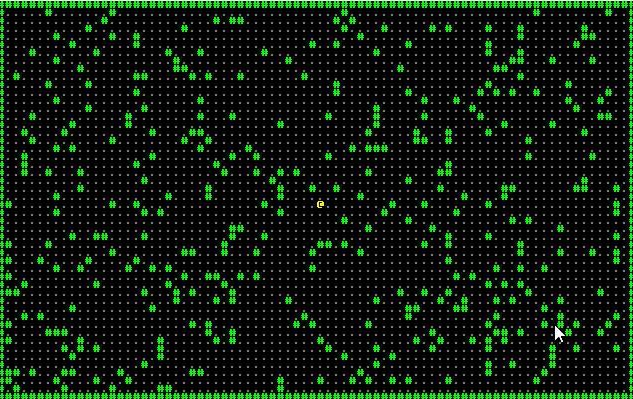

# Chapter 3 - Walking a Map

---

***关于这个教程***

*此教程是免费且开源的，所有代码均使用MIT许可证 - 所以你可以随意使用它。我希望你可以享受这个学习的过程，并制作出很棒的游戏。!*

*如果你喜欢这个教程并希望我继续写作，请考虑支持 [my Patreon](https://www.patreon.com/blackfuture).*

---

本教程的剩余部分将专门讲述制作一个 Roguelike 游戏。[Rogue](https://en.wikipedia.org/wiki/Rogue_video_game) 诞生于 1980，是一个文本模式的地牢探索游戏。它催生出一个完整的“roguelikes”游戏风格：程序生成的地图，在多个级别上搜寻目标并 “permadeath” (死后游戏重启)。这个定义是许多线上战斗游戏的来源；我宁愿避免这种情况！

一个没有探索地图的 Roguelike 游戏是没有意义的，因此在这一节我们将整理出一张地图，绘制并让你的游戏角色上在上面行走。我们从第二节的代码开始，但是移除了其中红色的笑脸及其向左运行的倾向。

## 定义地图图块

我们将允许两种图块类型：`Wall`以及`Floor`。我们可以用一个`enum`来表示它们 (学习更多关于枚举的内容，请参阅[rust 程序设计](https://doc.rust-lang.org/book/ch06-00-enums.html))：

```rust
#[derive(PartialEq, Copy, Clone)]
enum TileType {
    Wall, Floor
}
```

注意到我们使用了一些派生特性 (大量的使用派生宏，这里是 Rust 自身内置的)：`Copy`和`Clone`。`Clone`给类型添加了一个`.clone()`方法，允许以编程的方式进行拷贝。`Copy`将对象中默认的*转移所有权*的分配方式改成了拷贝 - 因此在`tile1 = tile2`之后，两个值依然合法有效，而不是进入了一种“转移所有权后的”状态。

`PartialEq`允许我们使用`==`对两个图块类型进行匹配。如果我们不派生这些特性，`if tile_type == TileType::Wall`将会编译失败！

## 构建一个简单的地图

我们将会创建一个返回图块`vec`的函数，用来表示一个简单的地图。我们将使用一个大小适用于整张地图的向量，这意味着我们需要一种方式来确定哪个数组索引位于给定的 x/y 坐标上。因此首先，我们创建一个名为`xy_idx`的函数：

```rust
pub fn xy_idx(x: i32, y: i32) -> usize {
    (y as usize * 80) + x as usize
}
```

这个函数很简单：它将`y`轴的值乘上地图的宽度 80，然后再加上`x`轴上的值。它保证了每个位置都会有一个图块，并高效的将其映射进内存中，以实现“从左到右”的读取。

我们在这里使用 rust 函数的简写方式。注意到该函数返回了一个`usize` (等价于 C/C++ 中的`size_t`) - 并且函数体在最后缺少一个`;`，在 rust 中，任何函数的结束语句如果缺少`;`，则该行将被视为`return`语句。因此它与`return (y as usize * 80) + x as usize`等价。这个特性来自于 rust 作者喜欢的的另一门语言，`ML` - 它使用与之相同的简写风格。使用这种风格将被视为“Rustaean” (规范的 rust；我总是将其想象成一个带有可爱的小爪子以及外壳的 rust 怪兽)，因此在本教程中，我们也将采用这种方式。

接着，我们编写一个*构造函数*来创建一个地图：

```rust
fn new_map() -> Vec<TileType> {
    let mut map = vec![TileType::Floor; 80*50];

    // Make the boundaries walls
    for x in 0..80 {
        map[xy_idx(x, 0)] = TileType::Wall;
        map[xy_idx(x, 49)] = TileType::Wall;
    }
    for y in 0..50 {
        map[xy_idx(0, y)] = TileType::Wall;
        map[xy_idx(79, y)] = TileType::Wall;
    }

    // Now we'll randomly splat a bunch of walls. It won't be pretty, but it's a decent illustration.
    // First, obtain the thread-local RNG:
    let mut rng = rltk::RandomNumberGenerator::new();

    for _i in 0..400 {
        let x = rng.roll_dice(1, 79);
        let y = rng.roll_dice(1, 49);
        let idx = xy_idx(x, y);
        if idx != xy_idx(40, 25) {
            map[idx] = TileType::Wall;
        }
    }

    map
}
```

这里有几个我们之前没遇到过的语法，因此让我们来分析一下：

1. `fn new_map() -> Vec<TileType>`指定了一个名为`new_map`的函数。它不携带任何参数，因此可以在任何地方调用。
2. 该函数返回了一个`Vec`。`Vec`是一个 Rust 向量(如果你对 C++ 比较熟悉，它其实就是 C++ 中的`std::vector`)。向量类似于数组(请参阅 [Rust by Example](https://doc.rust-lang.org/rust-by-example/primitives/array.html)) 的这一章节，它可以让你将一堆数据放入列表中，并可以访问每一个元素。和数组不同，`Vec`没有大小的限制 - 并且它的大小还可以在程序运行的时候进行变更。因此你可以`push`(添加)新的元素，也可以将其`remove`。关于向量的内容，[Rust by Example](https://doc.rust-lang.org/rust-by-example/std/vec.html) 有一节讲解的很好；学习它们是个不错的主意 - 因为它们处处都在使用。
3. `let mut map = vec![TileType::Floor; 80*50];`一个看起来让人感到疑惑的语句！让我们重点看一下：
    1. `let mut map`意思是“创建一个新的变量”(`let`)，“让我可以对这个变量进行修改”(`mut`)并将这个变量命名为“map”。
    2. `vec!`是另一个 Rust 标准库中内置的宏。感叹号 (exclamation mark) 表示这是一个过程宏 (和我们之前遇到的派生宏有所不同)。过程宏可以像函数一样运行 - 它们定义了一个过程，且只是减少了你们的输入而已。
    3. `vec!`宏在中括号中传入参数。
    4. 第一个参数是新创建的向量中每个元素的值。在这里，我们将每个条目都设置为`TileType`枚举中的`Floor`。
    5. 第二个参数是指我们应该创建多少个图块。这些图块都将被设置为我们在上面指定的值。在这里，我们的地图是 80x50 个图块 (4,000 个图块 - 但是我们让编译器来计算这个值!)。因此我们需要 4,000 个图块。
    6. 你可以通过调用`for _i in 0..4000 { map.push(TileType::Floor); }`来代替`vec!`。事实上，这就是该宏为你所做的事情 - 但是它确实减少了很多输入，很多事情都是宏自动帮你做了！
4. `for x in 0..80 {`是一个`for loop` ([参阅这里](https://doc.rust-lang.org/rust-by-example/flow_control/for.html))，就像我们在之前的示例中所用的那样。在这里，我们从 0 迭代到 79。
5. `map[xy_idx(x, 0)] = TileType::Wall;`首先调用`xy_idx`函数来获取`x, 0`的向量索引。然后它对向量进行检索，告诉它将这个位置的向量条目设置为`TileType::Wall`。我们对`x,49`又进行了一遍这样的操作。
6. 我们对`y`做了同样的事情，将其从 0 迭代到 79 - 并在地图上设置垂直方向的墙 (wall)。
7. `let mut rng = rltk::RandomNumberGenerator::new();`在`RLTK`中调用`RandomNumberGenerator`类型的`new`方法，并将其分配给一个名为`rng`的变量。我们让 RLTK 给我们一个新的随机数生成器。
8. `for _i in 0..400 {`和其他的`for`相同，但是注意到`i`前面的`_`。我们并不关心`i`的值 - 我们只是想要循环 400 次而已。如果你有一个未使用的变量，Rust 将会给你一个提示；在该变量之前添加一个下划线前缀让 Rust 知道(不使用该变量)是可以的，我们就是要这么做。
9. `let x = rng.roll_dice(1, 79);`调用我们在第 7 点说明的`rng`，让它生成一个范围在 1 到 79 (包含) 之内的随机数。RLTK 并没有排除最大的值，因为它试图反应 1 个 20面骰子 (`1d20` 或类似的骰子，如`2d6`，即 2 个 6面骰，范围是 2 到 12) 的 D&D 惯例。在这里，我们应该庆幸计算机不关心发明一个 79 面骰子的几何难度！我们也会获取一个范围在 1 到 49 的`y`值。我们掷虚拟的骰子，并依此在地图上指定一个随机的位置。
10. 我们将变量`idx` (”index“缩写)设置为向量的索引(通过我们之前定义的`xy_idx`)，以用于滚动的坐标。
11. `if idx != xy_idx(40, 25) {`检查`idx`不在正中间(我们将这里作为起点，因此我们不希望从墙内开始)。
12. 如果这不是中间位置，则我们将随机位置设置为墙。

这十分简单：它将墙放置在地图的外部边缘周围，然后在不是玩家起点位置的任何地方添加 400 个随机墙。

## 让地图对世界可见

Specs 中包含了”resources“的概念 - 它共享资源，让整个 ECS 都可以使用。因此在我们的`main`函数中，我们在世界中添加了一个随机生成的地图：

```rust
gs.ecs.insert(new_map());
```

现在可以在 ECS 可以看到的任何地方使用该地图！在你的代码中，你可以通过相当笨重的`let map = self.ecs.get_mut::<Vec<TileType>>();`语句访问地图；系统可以轻松的使用它。这里有多种获取地图上的值得方法，包括`ecs.get`，`ecs.fetch`。`get_mut`可以获取地图的可变引用(你可以对其进行修改) - 它封装在`Option`中(以防不存在该地图)。`fetch`跳过`Option`类型并直接给你一个地图。你可以在 [Specs Book](https://specs.amethyst.rs/docs/tutorials/04_resources.html) 中了解更多内容。

## 绘制地图

既然我们已经有了一个可用的地图，我们应该将其打印在屏幕上！完整的绘制地图的代码如下所示：

```rust
fn draw_map(map: &[TileType], ctx : &mut Rltk) {
    let mut y = 0;
    let mut x = 0;
    for tile in map.iter() {
        // Render a tile depending upon the tile type
        match tile {
            TileType::Floor => {
                ctx.set(x, y, RGB::from_f32(0.5, 0.5, 0.5), RGB::from_f32(0., 0., 0.), rltk::to_cp437('.'));
            }
            TileType::Wall => {
                ctx.set(x, y, RGB::from_f32(0.0, 1.0, 0.0), RGB::from_f32(0., 0., 0.), rltk::to_cp437('#'));
            }
        }

        // Move the coordinates
        x += 1;
        if x > 79 {
            x = 0;
            y += 1;
        }
    }
}
```

这非常简单，并且使用的是我们已经介绍过的概念。在声明中，我们将地图作为`&[TileType]`而不是`&Vec<TileType>`传入；这可以让我们传入地图的(部分)切片，如果我们想要这么做的话。我们现在还不会这么做，但是在之后这将很有用。这也是 Rust 中一种惯用的方式 (idiomatic Rust)，但是`clippy` 代码校验可能会发出警告。[如果你感兴趣的话，rust 程序设计可以告诉你更多关于切片的内容](https://doc.rust-lang.org/rust-by-example/primitives/array.html)。

否则，它将利用我们存储地图的方式，一行接一行的存储。因此它遍历了整个地图的结构，将每个图块的`x`坐标加 1。如果达到了地图的宽度，则将`x`  清零，并将其加到`y`上。使用这种方式就不用在地图上重复读取 - 那会降低程序的性能。实际的渲染十分简单：我们`match`图块的类型，并绘制墙/地板的周期或哈希值。

我们应该调用该函数！在我们的`tick`函数中，添加：

```rust
let map = self.ecs.fetch::<Vec<TileType>>();
draw_map(&map, ctx);
```

我们在之前都没有遇到过`fetch`函数。`fetch` requires that you promise that you know that the resource you are requesting really does exist - and will crash if it doesn't. It doesn't *quite* return a reference - it's a `shred` type, which *acts* like a reference most of the time but occasionally needs a bit of coercing to *be* one. We'll worry about that bridge when it comes time to cross it, but consider yourself warned!

## Making walls solid

So now if you run the program (`cargo run`), you'll have a green and grey map with a yellow `@` who can move around. Unfortunately, you'll quickly notice that the player can walk through walls! Fortunately, that's pretty easy to rectify.

To accomplish this, we modify the `try_move_player` to read the map and check that the destination is open:

```rust
fn try_move_player(delta_x: i32, delta_y: i32, ecs: &mut World) {
    let mut positions = ecs.write_storage::<Position>();
    let mut players = ecs.write_storage::<Player>();
    let map = ecs.fetch::<Vec<TileType>>();

    for (_player, pos) in (&mut players, &mut positions).join() {
        let destination_idx = xy_idx(pos.x + delta_x, pos.y + delta_y);
        if map[destination_idx] != TileType::Wall {
            pos.x = min(79 , max(0, pos.x + delta_x));
            pos.y = min(49, max(0, pos.y + delta_y));
        }
    }
}
```

The new parts are the `let map = ...` part, which uses `fetch` just the same way as the main loop (this is the advantage of storing it in the ECS - you can get to it everywhere without trying to coerce Rust into letting you use global variables!). We calculate the cell index of the player's destination with `let destination_idx = xy_idx(pos.x + delta_x, pos.y + delta_y);` - and if it isn't a wall, we move as normal.

Run the program (`cargo run`) now, and you have a player in a map - and can move around, properly obstructed by walls.



The full program now looks like this:

```rust
use rltk::{GameState, Rltk, RGB, VirtualKeyCode};
use specs::prelude::*;
use std::cmp::{max, min};
use specs_derive::*;


#[derive(Component)]
struct Position {
    x: i32,
    y: i32,
}

#[derive(Component)]
struct Renderable {
    glyph: rltk::FontCharType,
    fg: RGB,
    bg: RGB,
}
 
#[derive(Component, Debug)]
struct Player {}

#[derive(PartialEq, Copy, Clone)]
enum TileType {
    Wall, Floor
}

struct State {
    ecs: World
}

pub fn xy_idx(x: i32, y: i32) -> usize {
    (y as usize * 80) + x as usize
}

fn new_map() -> Vec<TileType> {
    let mut map = vec![TileType::Floor; 80*50];

    // Make the boundaries walls
    for x in 0..80 {
        map[xy_idx(x, 0)] = TileType::Wall;
        map[xy_idx(x, 49)] = TileType::Wall;
    }
    for y in 0..50 {
        map[xy_idx(0, y)] = TileType::Wall;
        map[xy_idx(79, y)] = TileType::Wall;
    }

    // Now we'll randomly splat a bunch of walls. It won't be pretty, but it's a decent illustration.
    // First, obtain the thread-local RNG:
    let mut rng = rltk::RandomNumberGenerator::new();

    for _i in 0..400 {
        let x = rng.roll_dice(1, 79);
        let y = rng.roll_dice(1, 49);
        let idx = xy_idx(x, y);
        if idx != xy_idx(40, 25) {
            map[idx] = TileType::Wall;
        }
    }

    map
}

fn try_move_player(delta_x: i32, delta_y: i32, ecs: &mut World) {
    let mut positions = ecs.write_storage::<Position>();
    let mut players = ecs.write_storage::<Player>();
    let map = ecs.fetch::<Vec<TileType>>();

    for (_player, pos) in (&mut players, &mut positions).join() {
        let destination_idx = xy_idx(pos.x + delta_x, pos.y + delta_y);
        if map[destination_idx] != TileType::Wall {
            pos.x = min(79 , max(0, pos.x + delta_x));
            pos.y = min(49, max(0, pos.y + delta_y));
        }
    }
}

fn player_input(gs: &mut State, ctx: &mut Rltk) {
    // Player movement
    match ctx.key {
        None => {} // Nothing happened
        Some(key) => match key {
            VirtualKeyCode::Left => try_move_player(-1, 0, &mut gs.ecs),
            VirtualKeyCode::Right => try_move_player(1, 0, &mut gs.ecs),
            VirtualKeyCode::Up => try_move_player(0, -1, &mut gs.ecs),
            VirtualKeyCode::Down => try_move_player(0, 1, &mut gs.ecs),
            _ => {}
        },
    }
}

fn draw_map(map: &[TileType], ctx : &mut Rltk) {
    let mut y = 0;
    let mut x = 0;
    for tile in map.iter() {
        // Render a tile depending upon the tile type
        match tile {
            TileType::Floor => {
                ctx.set(x, y, RGB::from_f32(0.5, 0.5, 0.5), RGB::from_f32(0., 0., 0.), rltk::to_cp437('.'));
            }
            TileType::Wall => {
                ctx.set(x, y, RGB::from_f32(0.0, 1.0, 0.0), RGB::from_f32(0., 0., 0.), rltk::to_cp437('#'));
            }
        }

        // Move the coordinates
        x += 1;
        if x > 79 {
            x = 0;
            y += 1;
        }
    }
}

impl GameState for State {
    fn tick(&mut self, ctx : &mut Rltk) {
        ctx.cls();

        player_input(self, ctx);
        self.run_systems();

        let map = self.ecs.fetch::<Vec<TileType>>();
        draw_map(&map, ctx);

        let positions = self.ecs.read_storage::<Position>();
        let renderables = self.ecs.read_storage::<Renderable>();

        for (pos, render) in (&positions, &renderables).join() {
            ctx.set(pos.x, pos.y, render.fg, render.bg, render.glyph);
        }
    }
}

impl State {
    fn run_systems(&mut self) {
        self.ecs.maintain();
    }
}

fn main() -> rltk::BError {
    use rltk::RltkBuilder;
    let context = RltkBuilder::simple80x50()
        .with_title("Roguelike Tutorial")
        .build()?;
    let mut gs = State {
        ecs: World::new()
    };
    gs.ecs.register::<Position>();
    gs.ecs.register::<Renderable>();
    gs.ecs.register::<Player>();

    gs.ecs.insert(new_map());

    gs.ecs
        .create_entity()
        .with(Position { x: 40, y: 25 })
        .with(Renderable {
            glyph: rltk::to_cp437('@'),
            fg: RGB::named(rltk::YELLOW),
            bg: RGB::named(rltk::BLACK),
        })
        .with(Player{})
        .build();

    rltk::main_loop(context, gs)
}
```

**The source code for this chapter may be found [here](https://github.com/thebracket/rustrogueliketutorial/tree/master/chapter-03-walkmap)**

[Run this chapter's example with web assembly, in your browser (WebGL2 required)](https://bfnightly.bracketproductions.com/rustbook/wasm/chapter-03-walkmap/)

---

Copyright (C) 2019, Herbert Wolverson.

---
